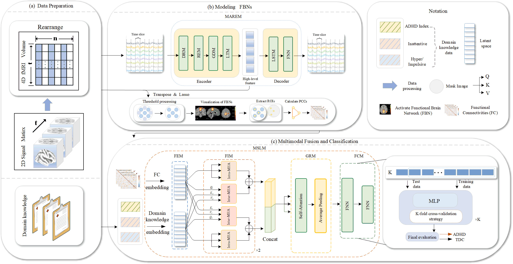

###  Note: 


# ADHD Diagnosis Guided by Functional Brain Networks Combined with Domain Knowledge


## Framework



## Setup

### 1）Environment

* Linux 

* Python>=3.6

* CUDA 10.0，cuDNN 7.4.2

  #### Install python packages

  ```
  conda create -n ADF-FAD python=3.6 # 安装python3.6版本的虚拟环境
  conda activate ADF-FAD  # 激活虚拟环境
  pip install -r requirements.txt # 安装环境依赖
  ```

### 2) Dataset 

* Datasets are sourced from the public ADHD-200 project dataset, accessible at [](http://fcon 1000.projects.nitrc.org/indi/adhd200/.)

  

### 3）Data preprocessing

* The following code is to perform the conversion of 4D data to 2D data using nilearn. Taking the NYU dataset as an example, the same operational steps apply to other sites.

  ```
  python ADHD200Process_NYU.py
  ```

## Modeling FBNs

## 1) Train

* Perform compression reconstruction of fMRI data and extract more representative brain features.

```
python Train_NYU.py
```

## 2) Predict

* Utilize the trained Encoder to extract brain features.

```
python Predict_NYU.py
```

## 3) Visible-FBNs

* Visualization of activated brain networks.

```
python Visiable_NYU.py
```

## Multimodal Fusion

*  Implement the interactive fusion of domain knowledge and functional connectivity features.

```
python multimodal_fusion.py
```

## Cross-validation classification

* Achieve ADHD Diagnosis using K-fold cross-validation 

```
python train_CrossValidation_NYU.py
```


